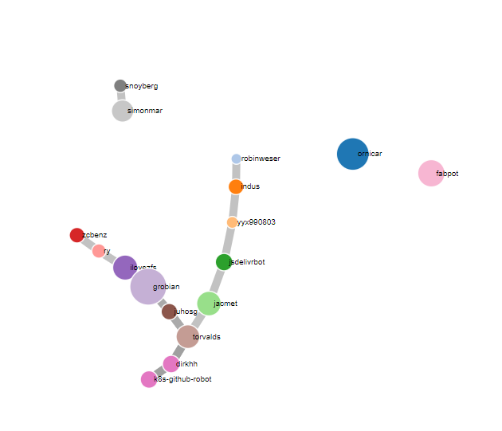

# GitHub API app


The idea for this app was to crawl through github users and for a given user get all their repos and then find the user who had the highest number of commits in that set of repos and then recurse for that user, thus producing a chain of highest committers for a given user.
Note that eventually one reaches a user who is the highest committer in their own set of repos and thus the crawl terminates.

To run the crawler your app must be authenticated. Create `./src/Token.hs` and put your token and username in. Make sure git is ignoring Token.hs and any editor generated swap files so that the token isn't pushed to github.
```haskell
-- file: ./src/Token.hs
module Token where
import Data.ByteString.UTF8 (fromString)

-- Include the double quotes, exclued the angle brackets.
token = fromString "<your-token-goes-here>"
authenticationName = fromString "<your-github-username-goes-here>"
```

The usernames for which these chains will be generated are specified in a list in `src/Main.hs`.

To run the program run `stack run`. Note, it could take hours to run completely.

Gathering lots of these chains gives us a graph which is saved into `alltogether.json`. The file can be loaded into the visualization folder with:
```powershell
cp alltogether.json d3\
```

To display the graph vsually in your browser run
```powershell
.\run-vis.ps1
```
and point your browser to `localhost:8000`.

The visualization is a force directed graph based on Mike Bostock's visualization of co-occurence of characters in Les Misérables (https://gist.github.com/mbostock/4062045).

# Issues
The crawl is extremely slow. I tried to make a branch where the api calls are run concurrently, but it is not running correctly or producing correct results.
